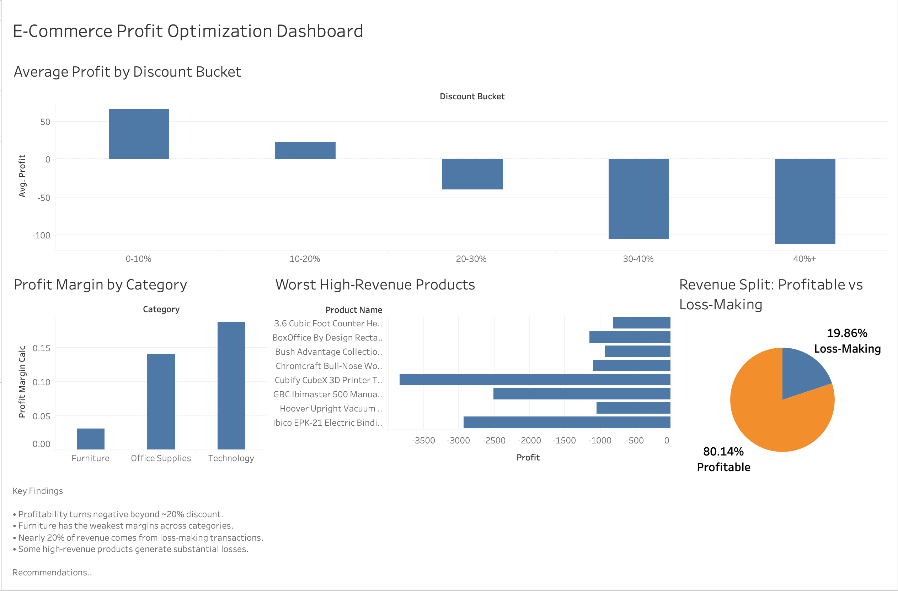

# E-Commerce Profit Optimization Engine

## Overview

This project analyzes an e-commerce dataset to identify how discounting impacts profitability across products and categories.

The objective was to uncover:

- which products generate revenue but destroy profit
- which categories are most discount-sensitive
- where profit leakage occurs
- what business actions could improve profitability

The project combines SQL analysis, Python EDA, and Tableau dashboarding to simulate a real business analytics workflow.

## Business Problem

The business generates strong revenue, but profitability is inconsistent due to aggressive discounting and inefficient product/category strategies.

Key questions explored:

- At what discount level does profitability turn negative?
- Which products contribute most to losses?
- Which categories are most sensitive to discounting?
- How much revenue comes from loss-making transactions?

## Tools & Technologies

- Python (Pandas, Matplotlib, Seaborn)
- SQL (SQLite)
- Tableau
- Jupyter Notebook
- Git & GitHub

## Project Workflow

1. Data cleaning and preprocessing using Python
2. SQL analysis for profitability and discount behavior
3. Exploratory data analysis (EDA) using Python visualizations
4. Interactive dashboard creation in Tableau
5. Business recommendation generation based on analytical findings

## Key Insights

- Profitability turns negative beyond the 20–30% discount range.
- Furniture is the most discount-sensitive category and has the weakest profit margins.
- Approximately 20% of total revenue comes from loss-making transactions.
- Several high-revenue products generate substantial losses despite strong sales.
- Simulated discount controls indicated a potential ~25% profit improvement opportunity.

## Business Recommendations

- Implement discount caps below 20% for sensitive categories.
- Reduce aggressive discounting within the Furniture category.
- Monitor and re-evaluate recurring loss-making products.
- Prioritize profitability-focused pricing strategies instead of revenue-only growth.

## Dashboard Preview

## Future Improvements

- Add predictive profitability modeling
- Introduce customer-level segmentation analysis
- Build automated pricing recommendation logic
- Deploy dashboard publicly
